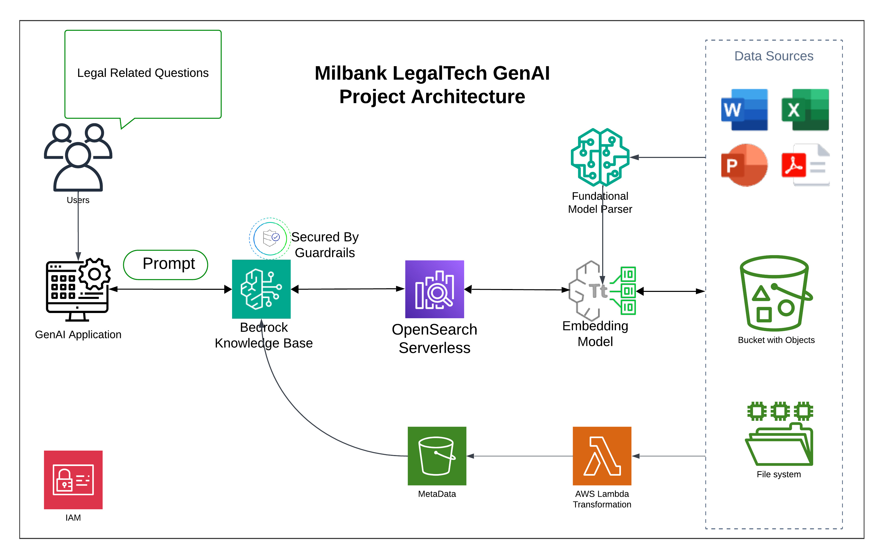

# milbank-genai-demo

## Todo List
__CloudFormation__

- [x] S3 creation for documents and metadata
- [x] base iam role for bedrock knowledgebase 
- [x] cfn nested stacks implementation
- [x] lambda for knowledge base parser
- [] bedrock knowledgebase creation
- [] AMI with proper dependencies and  application installed
- [] VPC and networking 
- [] spin up EC2 with AMI
- [x] create github repo for teamwork

__Other__
- [x] Architecture Diagram
- [] End to End test

